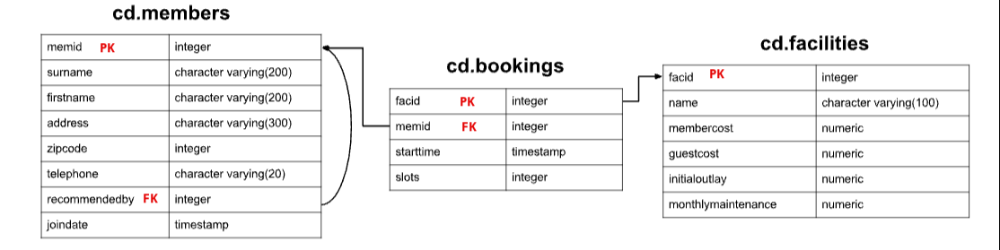

## Exercise 1: Write SQL Statemates to create the following tables  



## My approach 
### cd.members

```sql

CREATE TABLE cd.members(
  memid integer surname varchar(200), 
  firstname varchar(200), 
  address varchar(300), 
  zipcode integer, 
  telephone varchar(20), 
  recommendedby integer, 
  joindate timestamp, 
  PRIMARY KEY (memid) FOREIGN KEY (recommendedby) REFERENCES cd.members(memid)
);

```


### cd.bookings

```sql

CREATE TABLE cd.bookings(
  facid integer, 
  memeid integer, 
  starttime timestamp, 
  slots integer, 
  PRIMARY KEY(facid) FOREIGN KEY (memid) REFERENCES cd.members(memid)
);

```


### cd.facilities

```sql
CREATE TABLE cd.facilities(
  facid integer, 
  name varchar(100), 
  membercost numeric, 
  guestcost numeric, 
  initialoutlay numeric, 
  monthlymaintenance numeric, 
  PRIMARY KEY (facid)
);


```
## Solution: cd.memebers
```sql
CREATE TABLE cd.members(
  memid integer NOT NULL, 
  surname character varying(200) NOT NULL, 
  firstname character varying(200) NOT NULL, 
  address character varying(300) NOT NULL, 
  zipcode integer NOT NULL, 
  telephone character varying(20) NOT NULL, 
  recommendedby integer, 
  joindate timestamp NOT NULL, 
  CONSTRAINT members_pk PRIMARY KEY (memid), 
  CONSTRAINT fk_members_recommendedby FOREIGN KEY (recommendedby) REFERENCES cd.members(memid) ON DELETE 
  SET 
    NULL
);

```

## Solution: cd.facilities
```sql
CREATE TABLE cd.facilities(
  facid integer NOT NULL, 
  name character varying(100) NOT NULL, 
  memebercost numeric NOT NULL, 
  guestcost numeric NOT NULL, 
  initialoutlay numeric NOT NULL, 
  monthlymaintenance numeric NOT NULL, 
  CONSTRAINT facilities_pk PRIMARY KEY(facid)
);

```


## Solution: cd.bookings
```sql
CREATE TABLE cd.bookings(
  bookid integer NOT NULL, 
  facid integer NOT NULL, 
  memid integer NOT NULL, 
  starttime timestamp NOT NULL, 
  slots integer NOT NULL, 
  CONSTRAINT bookings_pk PRIMARY KEY (bookid), 
  CONSTRAINT fk_bookings_facid FOREIGN KEY (facid) REFERENCES cd.facilities(facid), 
  CONSTRAINT fk_bookings_memid FOREIGN KEY (memid) REFERENCES cd.members(memid)
);

```


### SQL exercise questions

1. The club is adding a new facility - a spa. We need to add it into the facilities table. Use the following values:
facid: 9, 
Name: 'Spa', 
membercost: 20, 
guestcost: 30, 
initialoutlay: 100000, 
monthlymaintenance: 800.

```sql
INSERT INTO cd.facilities (
  facid, name, membercost, guestcost, 
  initialoutlay, monthlymaintenance
) 
VALUES 
  (9, 'Spa', 20, 30, 100000, 800);

```
1. Let's try adding the spa to the facilities table again. This time, though, we want to automatically generate the value for the next facid, rather than specifying it as a constant. Use the following values for everything else:
   Name: 'Spa',
   membercost: 20, 
   guestcost: 30, 
   initialoutlay: 100000, 
   monthlymaintenance: 800.
```sql
INSERT INTO cd.facilities(
  facid, name, membercost, guestcost, 
  initialoutlay, monthlymaintenance
) 
VALUES 
  (
    (
      SELECT 
        COUNT(facid) 
      from 
        cd.facilities
    ), 
    'Spa', 
    20, 
    30, 
    100000, 
    800
  );

```

1. We made a mistake when entering the data for the second tennis court. The initial outlay was 10000 rather than 8000: you need to alter the data to fix the error.
```sql
UPDATE 
  cd.facilities 
SET 
  initialoutlay = 10000 
WHERE 
  facid = 1;

   #WHERE name LIKE 'Tennis%';
```

4.We want to alter the price of the second tennis court so that it costs 10% more than the first one. Try to do this without using constant values for the prices, so that we can reuse the statement if we want to.

```sql
UPDATE 
  cd.facilities 
SET 
  membercost =(
    SELECT 
      membercost 
    FROM 
      cd.facilities 
    WHERE 
      facid = 1
  )* 1.1, 
  guestcost =(
    SELECT 
      guestcost 
    FROM 
      cd.facilities 
    WHERE 
      facid = 1
  )* 1.1 
WHERE 
  facid = 1;
```

5.As part of a clearout of our database, we want to delete all bookings from the cd.bookings table. How can we accomplish this?
```sql
DELETE FROM 
  cd.bookings

```

6.We want to remove member 37, who has never made a booking, from our database. How can we achieve that?
```sql
DELETE FROM 
  cd.members 
WHERE 
  memid = 37;

```
7.How can you produce a list of facilities, with each labelled as 'cheap' or 'expensive' depending on if their monthly maintenance cost is more than $100? Return the name and monthly maintenance of the facilities in question.
```sql
SELECT 
  name, 
  CASE WHEN monthlymaintenance > 100 then 'expensive' ELSE 'cheap' END AS cost 
FROM 
  cd.facilities;
```
1. You, for some reason, want a combined list of all surnames and all facility names. Yes, this is a contrived example :-). Produce that list!
```sql
SELECT 
  cd.members.surname 
FROM 
  cd.members 
UNION 
SELECT 
  cd.facilities.name 
FROM 
  cd.facilities

```
9. How can you produce a list of the start times for bookings by members named 'David Farrell'?
```sql
SELECT 
  cd.bookings.starttime 
FROM 
  cd.bookings 
  JOIN cd.members ON cd.bookings.memid = cd.members.memid 
WHERE 
  firstname = 'David' 
  and surname = 'Farrell'

```
10. How can you produce a list of the start times for bookings for tennis courts, for the date '2012-09-21'? Return a list of start time and facility name pairings, ordered by the time.
    
```sql
SELECT 
  cd.bookings.starttime as start, 
  cd.facilities.name 
FROM 
  cd.bookings 
  JOIN cd.facilities on cd.bookings.facid = cd.facilities / facid 
WHERE 
  cd.bookings.starttime >= '2012-09-21' 
  and cd.bookings.starttime < '2012-09-22' 
  and cd.facilities.name LIKE 'Tennis%';
```

11.  How can you output a list of all members, including the individual who recommended them (if any)? Ensure that results are ordered by (surname, firstname).
```sql
SELECT 
  mem.firstname as memfname, 
  mem.surname as memsname, 
  rec.firstname as recfname, 
  rec.surname as recsname 
FROM 
  cd.members mem 
  LEFT JOIN cd.members rec ON rec.memid = mem.recommendedby 
ORDER BY 
  memsname, 
  memfname

```


